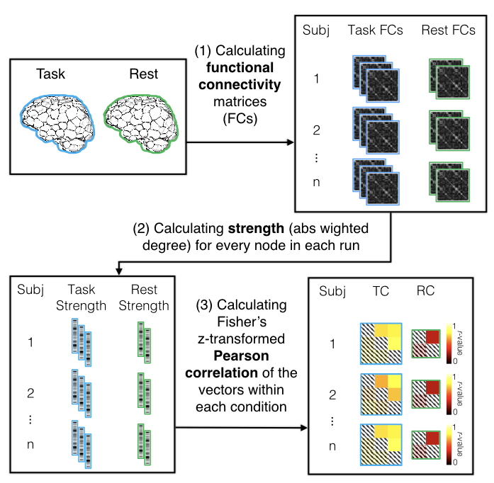

# Higher-order Predictive Modeling

	

These set of functions are used to generate the anlaysis in Salehi et al. [1]. This paper uses data from three Yale data sets (n-back, gradCPT, and ANT tasks) and the Human Connectome Project (HCP) S900 release [2]. This repository includes MATLAB and R functions to develope the higher-order measure predictive modeling.

### References

[1] Mehraveh Salehi, Dustin Scheinost, Monica D. Rosenberg, Emily S. Finn, Marvin M. Chun, R. Todd Constable. (2019) Brain network stability and flexibility form a generalizable predictive model of sustained attention. Under review.

[2] Van Essen, D. C., Smith, S. M., Barch, D. M., Behrens, T. E., Yacoub, E., Ugurbil, K., & Wu-Minn HCP Consortium. (2013). The WU-Minn human connectome project: an overview. Neuroimage, 80, 62-79.

